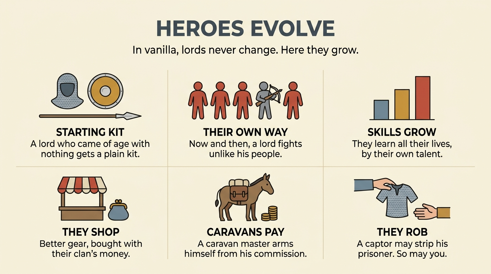

# Heroes Evolve

A Mount & Blade II: Bannerlord mod. In vanilla, AI lords keep the same
equipment and skills from 18 until they die. Here they develop: they gain skills
over the years, buy their own gear in town markets, and take it off each other
after a battle.



- **Steam Workshop:** https://steamcommunity.com/sharedfiles/filedetails/?id=3798647413
- Built for Bannerlord **v1.4.8**. Requires **Mod Configuration Menu (MCM) v5**.
- Nothing is written to your save: safe to add to a campaign in progress, or to
  remove from one.
- Every system can be switched off on its own.

## What it does

| System | In one line |
|---|---|
| Starting kit | Lords who come of age with nothing — a known TaleWorlds bug — get a plain kit matched to culture, role and age. |
| Their own way | Now and then a lord comes of age armed for what he is good at, within what his culture's troops actually field. |
| Skills grow | Three hidden talents — combat, management, seafaring — decide how fast each hero learns and where he stops. |
| Shopping | Lords buy better versions of what they already carry, with their clan's money, capped by their skills. |
| Caravans | A caravan master arms himself from a commission you set. |
| Robbery | Captors may strip their prisoners, on a roll weighted by character. A robbed man comes back in basic gear of the same kinds he carried. |
| Vengeance | Whoever is robbed swears vengeance, and that clan strips the robber's people in return when it captures one. One robbery, one answer. |

The full description, with every figure, is in
[docs/store-description.bbcode](docs/store-description.bbcode). The diagrams are
in [docs/gallery](docs/gallery).

## Install

Subscribe on the Steam Workshop, or copy the `HeroesEvolve` folder from a
release into `Mount & Blade II Bannerlord/Modules/` and tick it in the launcher.
Load order sorts itself: the module declares what it depends on.

## Build from source

You need:

- Windows and PowerShell 7
- Visual Studio 2022 Build Tools, for its Roslyn `csc.exe`, and .NET Framework 4
- Bannerlord v1.4.8 installed. The build references the game's own assemblies,
  which are not part of this repository.

Two paths can be overridden with environment variables:

| Variable | Default |
|---|---|
| `BANNERLORD_PATH` | `D:\SteamLibrary\steamapps\common\Mount & Blade II Bannerlord` |
| `CSC_PATH` | `C:\Program Files (x86)\Microsoft Visual Studio\2022\BuildTools\MSBuild\Current\Bin\Roslyn\csc.exe` |

```powershell
pwsh build/build-tests.ps1    # the pure-rule tests; the game need not be installed
pwsh build/build-mod.ps1      # compiles and deploys into the game's Modules folder
pwsh build/verify-api.ps1     # checks that every game member the DLL uses exists in v1.4.8
pwsh build/pack-release.ps1   # builds a release zip in .tmp/
```

Layout:

- `src/Core` — the rules, free of TaleWorlds types, and covered by `tests/`
- `src/Game` — everything that touches the game
- `ModuleData/Languages` — translations: German, French, Russian, Spanish, Turkish

## Console commands

The developer console only opens with `cheat_mode = 1` in `engine_config.txt`.

| Command | What it does |
|---|---|
| `hev.census` | Writes a survey of every lord in the campaign to the log |
| `hev.dry_run <hero>` | Shows what the mod would do for a hero, without changing anything |
| `hev.market <hero>` | Shows what a hero would buy in the town you are in |
| `hev.feud [hero]` | Shows how likely a lord is to strip you, what is sworn between your houses and what stripping him would cost; the census lines for every house with no name given |
| `hev.test_repair <hero>` | Reproduces the come-of-age bug on a hero, then repairs it |
| `hev.test_robbery [hero]` | Robs a hero, or one lord of every culture with no name given |
| `hev.test_oath <hero>` | Puts a lord on record as having stripped you, so that your clan is owed |
| `hev.test_plan` | Prints the console lines that stage the robbery tests, with names from the campaign you have loaded |
| `hev.test_release` | Shows the notice a freed player gets |

The `test_` commands change the campaign. Use a throwaway save.

The log is at `%LOCALAPPDATA%\Mount and Blade II Bannerlord\logs\hev.log`.

## License

MIT — see [LICENSE](LICENSE).
